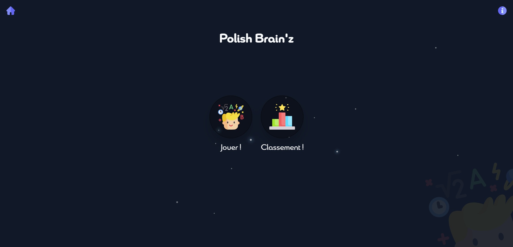

# Polish Brain'z

### Aperçu visuel (sans avoir besoin d'installer et lancer le projet)
--> voir le fichier Polish Brain'z App !  
--> lien youtube directement -> https://youtu.be/f0HBUGI-c4U

# Install
## base  
Besoin de java 17.0.1 2021-10-19 LTS  
Besoin de Tomee microprofile 8.0.8  

### Dans le dossier de tomee  
`apache-tomee/conf/tomee.xml`
````
<Resource id="PostgreSQL Database" type="DataSource">
    JdbcDriver   org.postgresql.Driver
    JdbcUrl  jdbc:postgresql://localhost:5432/polish_brain_z
    UserName     postgres
    Password     xhesHLa7qKAK
</Resource
````
### Importer le jar dans tomee
dans ``apache-tomee\lib``  
prendre la version 42.3.1  
https://jdbc.postgresql.org/download.html  

### créer la base de donnée dans postgresql avec les données
``copier coller le script createTable dans votre base de donnée PostGresSQL``

### Configuration tomee
Voici les configuration utilisées sur Tomee


### enfin - Clean maven
``mvn clean -P local``
``mvn install``

